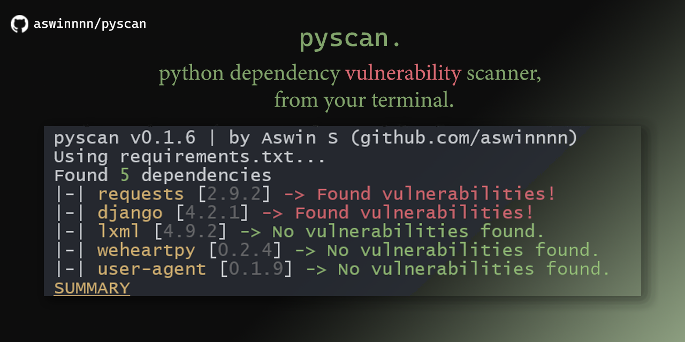

<h1 align="center"> 🐍 Pyscan </h1>

  [](https://pypi.org/project/pyscan-rs) [](https://crates.io/crates/pyscan) [](https://GitHub.com/aswinnnn/pyscan/issues/) [](https://img.shields.io/github/languages/top/aswinnnn/pyscan)

<h4 align="center"> 

<!--  -->



</h4>

<h5 align="center"> <i>A dependency vulnerability scanner for your python projects, straight from the terminal.</i> </h5>

+ can be used within large projects. (see [benchmarks](BENCHMARKS.md))
+ automatically finds dependencies either from configuration files or within source code.
+ support for poetry,hatch,filt,pdm and can be integrated into existing build processes.
+ hasn't been battle-hardened yet. PRs and issue makers welcome.

## 🕊️ Install

```bash
pip install pyscan-rs
```
**look out for the "-rs"** part
or

```bash
cargo install pyscan
```

check out the [releases](https://github.com/aswinnnn/pyscan/releases).

## 🐇 Usage

Go to your python source directory (or wherever you keep your `requirements.txt`/`pyproject.toml`) and run:

```bash
> pyscan
```
or
```bash
> pyscan -d path/to/src
```

<!-- ## Docker

[WARNING: docker subcommand currently does not work, if you are installing pyscan solely for that purpose. It will be fixed and released in the next version. Thanks for the patience, people with actual jobs (i dont know anyone else who actually uses docker)]

Pyscan can scan inside docker images given you provide the correct path inside. This is still in its early stage and may break easily.

```bash
> pyscan docker -n my-docker-image -p /path/inside/container/to/source
```

by <i>"source"</i> I mean `requirements.txt`, `pyproject.toml` or your python files.
Note: Your docker engine/daemon should be running as pyscan utilizes the `docker create` command.  -->

<br>
Pyscan will find any dependencies added through poetry, hatch, filt, pdm, etc.
Here's the order of precedence for a source/config file:

+ `requirements.txt`
+ `pyproject.toml`
+ your source code (`.py`)

Pyscan will use your `pip` to find unknown versions, otherwise [pypi.org](https://pypi.org) for the latest version. Still, **Make sure you version-ize your requirements** and use proper [pep-508 syntax](https://peps.python.org/pep-0508/).

## Building

pyscan requires a rust version of `< v1.70`, and might be unstable on previous releases.
There's an overview of the codebase at [architecture](./architecture/). Grateful for all the contributions so far.

## 🦀 Note

pyscan doesn't make sure your code is safe from everything. Use all resources available to you like [safety](https://pypi.org/project/safety/) Dependabot, [`pip-audit`](https://pypi.org/project/pip-audit/), trivy and the likes.

## 🐰 Todo

As of October 15, 2023:

- [ ] Gather time to work on it (incredible task as a high schooler)
- [ ] Persistent state representation of a project's security.
- [ ] Graphical analysis of dependencies and their dependencies, and so on.
- [ ] Better display, search, filter of vulns  

## 🐹 Donate

While not coding, I am a broke high school student with nothing else to do. I appreciate all the help I can get.
