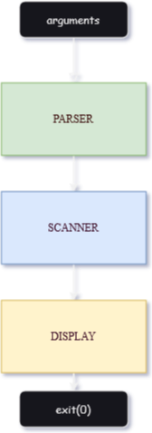

# 🐍 Architecture / Codebase Overview

<h4 align="center">

</h4>

<h5 align="center"> <i>A very vague representation of how an ideal pyscan run works with no arguments given.</i> </h5>

 

Pyscan is coded in a psuedo-procedural manner where the top level works just like any procedural program (the functions are "chained" in a way) but the internals use structs and models/classes to an extent enough to call it OOP. It's a mix of both worlds.

## Important files to look at

There's comments on almost anything comment-able and worthy. Feel free to look around.

- [`parser.rs`](../src/parser/mod.rs) - top level look at the parser. Check out [`extractor.rs`](../src/parser/extractor.rs) to really see the extraction and file discovery being done.

- [`scanner::api.rs`](../src/scanner/api.rs) - how the API stuff gets done using the struct `Osv`, look at `mod.rs` for a higher level view.
  
- [`docker.rs`](../src/docker/mod.rs) - handles getting and doing stuff with Docker.

- [`display.rs`](../src/display/mod.rs) - some functions used to print to the screen, not all though.

## Notes for contributers

- This thing will be updated every once in a while to detail how pyscan works in a much more articulate and better way, including subcommands and other arguments and quirks.

- If you think the codebase is designed badly, I don't know, it might be. I have never made a CLI tool before so, there's that. Open an issue or make a PR and I'm more than willing to learn from you.
  
- Please be descriptive and detailed in your PRs, comments and other decent things. It's very cool what the open source community has done for pyscan so far.
